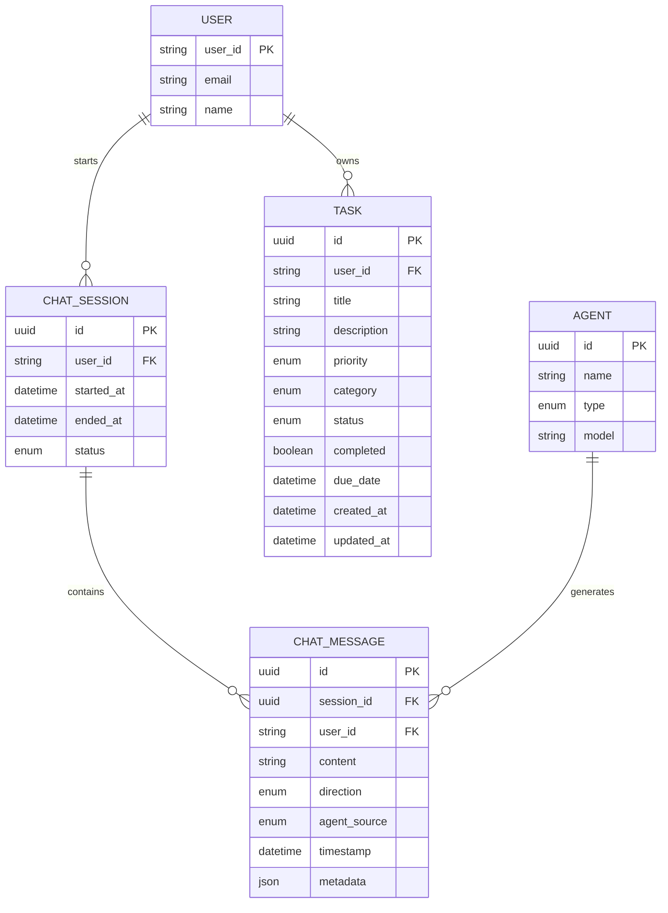

# Data Model: MCP Agent Integration

**Feature**: 009-agents-mcp
**Date**: 2026-01-13
**Purpose**: Define entities, relationships, and validation rules

---

## Core Entities

### 1. Agent
Represents an AI agent in the dual-agent system.

**Fields:**
- `id`: UUID (system-generated)
- `name`: String (e.g., "orchestrator", "urdu-specialist")
- `type`: Enum ["orchestrator", "urdu"]
- `description`: String (agent purpose)
- `model`: String (e.g., "mimo-v2-flash")
- `created_at`: DateTime

**Validation:**
- Name: Required, unique, 3-50 chars
- Type: Required, must be one of enum values
- Model: Required, must be authorized model

**State Transitions:**
- Active → Inactive (when system shuts down)
- No persistent state between requests (Constitution III)

---

### 2. ChatSession
Represents a single user-agent conversation session.

**Fields:**
- `id`: UUID (system-generated)
- `user_id`: String (from JWT, required)
- `started_at`: DateTime
- `ended_at`: DateTime (nullable)
- `status`: Enum ["active", "completed", "failed"]

**Validation:**
- user_id: Required, must match JWT token
- started_at: Required, auto-generated
- status: Required, defaults to "active"

**State Transitions:**
- active → completed (normal conversation end)
- active → failed (error/crash)
- No server-side message storage (stateless)

---

### 3. ChatMessage
Represents a single message in a conversation.

**Fields:**
- `id`: UUID (system-generated)
- `session_id`: UUID (references ChatSession)
- `user_id`: String (from JWT, required)
- `content`: String (user message or agent response)
- `direction`: Enum ["user_to_agent", "agent_to_user"]
- `agent_source`: Enum ["orchestrator", "urdu", null]
- `timestamp`: DateTime
- `metadata`: JSON (additional context)

**Validation:**
- content: Required, max 10,000 chars
- direction: Required
- agent_source: Required for agent responses
- user_id: Required, must match session

**State Transitions:**
- Created → Logged (immediate persistence for audit)

---

### 4. Task (Existing)
**Note**: This entity already exists in the system. MCP tools will interact with it.

**Fields:**
- `id`: UUID
- `user_id`: String (isolation key)
- `title`: String
- `description`: String (nullable)
- `priority`: Enum ["low", "medium", "high"]
- `category`: Enum ["work", "personal", "home", "other"]
- `status`: Enum ["pending", "completed"]
- `completed`: Boolean
- `due_date`: DateTime (nullable)
- `created_at`: DateTime
- `updated_at`: DateTime

**MCP Tool Access:**
- All CRUD operations must include user_id parameter
- Query operations must filter by user_id
- Update/Delete operations must validate user_id ownership

---

## Entity Relationships



---

## Validation Rules

### Input Validation (Pydantic Schemas)

#### ChatRequest
```python
class ChatRequest(BaseModel):
    message: str = Field(..., min_length=1, max_length=10000)

    @field_validator('message')
    def validate_message(cls, v):
        if not v.strip():
            raise ValueError('Message cannot be empty')
        return v.strip()
```

#### MCP Tool Parameters
```python
class TaskCreateParams(BaseModel):
    user_id: str = Field(..., description="User ID from JWT")
    title: str = Field(..., min_length=1, max_length=255)
    description: Optional[str] = Field(None, max_length=1000)
    priority: Literal["low", "medium", "high"]
    category: Literal["work", "personal", "home", "other"]
    due_date: Optional[datetime] = None

    @field_validator('title')
    def validate_title(cls, v):
        if not v.strip():
            raise ValueError('Title cannot be empty')
        return v.strip()
```

### Business Logic Validation

#### User Isolation
```python
def validate_user_ownership(user_id: str, task_id: UUID, session: Session) -> bool:
    """Ensure user can only access their own tasks"""
    task = session.get(Task, task_id)
    if not task or task.user_id != user_id:
        raise HTTPException(403, "Access denied")
    return True
```

#### Language Routing
```python
def route_to_agent(message: str) -> str:
    """Route message to appropriate agent"""
    if is_urdu_content(message):
        return "urdu-specialist"
    return "orchestrator"
```

---

## Data Flow Patterns

### User → Agent Communication
```
User Input → JWT Validation → Language Detection → Agent Routing → MCP Tool Call → Response
```

### MCP Tool Execution
```
Tool Call → User ID Extraction → Validation → Service Layer → Database → Structured Response
```

### Response Formatting
```python
# Success
{
    "success": True,
    "data": {
        "id": "123e4567-e89b-12d3-a456-426614174000",
        "title": "Buy groceries",
        "status": "pending"
    }
}

# Error
{
    "success": False,
    "error": "Task not found"
}
```

---

## Database Schema Considerations

### New Tables Required

#### `agents` table
```sql
CREATE TABLE agents (
    id UUID PRIMARY KEY DEFAULT gen_random_uuid(),
    name VARCHAR(50) NOT NULL UNIQUE,
    type VARCHAR(20) NOT NULL CHECK (type IN ('orchestrator', 'urdu')),
    description TEXT,
    model VARCHAR(100) NOT NULL,
    created_at TIMESTAMP WITH TIME ZONE NOT NULL DEFAULT now()
);
```

#### `chat_sessions` table
```sql
CREATE TABLE chat_sessions (
    id UUID PRIMARY KEY DEFAULT gen_random_uuid(),
    user_id TEXT NOT NULL,
    started_at TIMESTAMP WITH TIME ZONE NOT NULL DEFAULT now(),
    ended_at TIMESTAMP WITH TIME ZONE,
    status VARCHAR(20) NOT NULL CHECK (status IN ('active', 'completed', 'failed')),
    FOREIGN KEY (user_id) REFERENCES "user"(id) ON DELETE CASCADE
);
```

#### `chat_messages` table
```sql
CREATE TABLE chat_messages (
    id UUID PRIMARY KEY DEFAULT gen_random_uuid(),
    session_id UUID NOT NULL,
    user_id TEXT NOT NULL,
    content TEXT NOT NULL,
    direction VARCHAR(20) NOT NULL CHECK (direction IN ('user_to_agent', 'agent_to_user')),
    agent_source VARCHAR(20) CHECK (agent_source IN ('orchestrator', 'urdu')),
    timestamp TIMESTAMP WITH TIME ZONE NOT NULL DEFAULT now(),
    metadata JSONB,
    FOREIGN KEY (session_id) REFERENCES chat_sessions(id) ON DELETE CASCADE,
    FOREIGN KEY (user_id) REFERENCES "user"(id) ON DELETE CASCADE
);

-- Indexes for performance
CREATE INDEX idx_chat_messages_session ON chat_messages(session_id);
CREATE INDEX idx_chat_messages_user ON chat_messages(user_id);
CREATE INDEX idx_chat_messages_timestamp ON chat_messages(timestamp);
```

### Existing Tables (No Changes)
- `tasks` table (already exists, will be accessed via MCP tools)
- `user` table (already exists, referenced by foreign keys)

---

## Security Considerations

### Data Isolation
- **Query Level**: All database queries include `WHERE user_id = ?`
- **Tool Level**: All MCP tools require `user_id` parameter
- **API Level**: JWT validation on every request

### Audit Trail
- All chat messages persisted for compliance
- User_id included in all operations
- Timestamps for all state changes

### Input Sanitization
- Pydantic validation on all inputs
- Length limits to prevent abuse
- SQL injection prevention via parameterized queries

---

## Performance Considerations

### Indexes Required
- `chat_messages(session_id)` - for session history retrieval
- `chat_messages(user_id)` - for user-specific queries
- `chat_messages(timestamp)` - for chronological ordering

### Query Optimization
- Use existing TaskService for task operations (already optimized)
- Limit chat history retrieval to recent messages
- Implement pagination for large result sets

### Resource Management
- MCP server lifecycle per request (no persistent connections)
- Async database operations
- Connection pooling via existing infrastructure

---

## Migration Strategy

### Phase 1: Agent Foundation
- Create `agents` table
- No changes to existing tables
- Add agent registration logic

### Phase 2: MCP Integration
- Create `chat_sessions` and `chat_messages` tables
- No changes to existing `tasks` table
- Add MCP tools that wrap existing TaskService

### Phase 3: Frontend UI
- No database changes
- Add new frontend components
- Connect to existing `/api/chat` endpoint

---

## Testing Data

### Test Scenarios
1. **Dual-Agent Communication**
   - Input: "Hello, how are you?"
   - Expected: Orchestrator response + Urdu agent response (if Urdu content)

2. **Task Creation via MCP**
   - Input: "Create task 'Buy groceries' with high priority"
   - Expected: Task created, confirmation returned

3. **User Isolation**
   - User A creates task, User B tries to access
   - Expected: Access denied (403)

4. **Language Routing**
   - Input: Urdu text
   - Expected: Routed to Urdu agent, response in Urdu

### Sample Data
```sql
-- Pre-populate agents
INSERT INTO agents (name, type, description, model) VALUES
('orchestrator', 'orchestrator', 'Main coordinator agent', 'mimo-v2-flash'),
('urdu-specialist', 'urdu', 'Urdu language specialist', 'mimo-v2-flash');
```

---

## Integration Points

### With Existing System
- **Authentication**: Use existing JWT validation
- **Task Operations**: Use existing TaskService
- **Database**: Use existing Neon PostgreSQL connection
- **Frontend API**: Use existing apiClient

### New Components
- **Agent System**: New agents.py file
- **MCP Tools**: New task_serves_mcp_tools.py file
- **Chat Endpoint**: New `/api/chat` endpoint
- **Chatbot UI**: New `/chatbot` page

---

## Success Metrics

### Data Integrity
- ✅ Zero cross-user data access
- ✅ All operations scoped to user_id
- ✅ Audit trail complete for all operations

### Performance
- ✅ Chat response time < 2 seconds (p95)
- ✅ MCP tool execution < 500ms (p95)
- ✅ Database queries optimized with indexes

### Security
- ✅ All requests validated via JWT
- ✅ User isolation enforced at multiple levels
- ✅ Input validation prevents injection attacks

---

## Next Steps

1. **Create database migrations** for new tables
2. **Implement agent registration** in main.py
3. **Build MCP tools** with user isolation
4. **Create chat endpoint** with proper validation
5. **Add frontend chatbot** with agent attribution

All data models are now defined and ready for implementation planning.