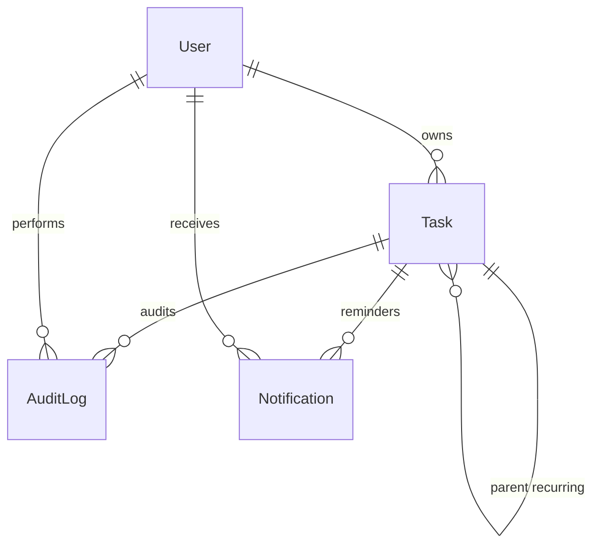

# Data Model: Branch 012 Features

**Feature**: Recurring Tasks, Reminders, Notifications & Audit Logging
**Date**: 2025-02-02

## Entity Definitions

### Task (Modified)

**Description**: Core task entity with added support for recurring tasks, reminders, and tags.

**Fields**:

| Field | Type | Nullable | Default | Description |
|-------|------|----------|---------|-------------|
| id | UUID | No | gen_random_uuid() | Primary key |
| title | VARCHAR(255) | No | - | Task title |
| description | TEXT | Yes | NULL | Optional description |
| priority | VARCHAR(20) | No | 'medium' | low/medium/high |
| category | VARCHAR(20) | No | 'personal' | work/personal/home/other |
| status | VARCHAR(20) | No | 'pending' | pending/completed |
| completed | BOOLEAN | No | FALSE | Completion flag |
| due_date | TIMESTAMP | Yes | NULL | Due date |
| **recurring_rule** | **VARCHAR(20)** | **Yes** | **NULL** | **daily/weekly/monthly/yearly** |
| **recurring_end_date** | **TIMESTAMP** | **Yes** | **NULL** | **Stop recurring after this date** |
| **parent_task_id** | **UUID** | **Yes** | **NULL** | **Links to parent recurring task** |
| **reminder_at** | **TIMESTAMP** | **Yes** | **NULL** | **When to send reminder** |
| **reminder_sent** | **BOOLEAN** | **No** | **FALSE** | **Track if reminder was sent** |
| **tags** | **TEXT[]** | **Yes** | **NULL** | **List of tag strings** |
| user_id | TEXT | No | - | Owner identifier |
| created_at | TIMESTAMP | No | NOW() | Creation timestamp |
| updated_at | TIMESTAMP | No | NOW() | Last update timestamp |

**Indexes**:
- PRIMARY KEY on id
- INDEX on user_id (implicit from existing)
- **INDEX on recurring_rule** WHERE recurring_rule IS NOT NULL
- **INDEX on reminder_at** WHERE reminder_at IS NOT NULL
- **INDEX on parent_task_id** WHERE parent_task_id IS NOT NULL
- **GIN INDEX on tags** (for array containment queries)

**Constraints**:
- FOREIGN KEY (parent_task_id) REFERENCES tasks(id) ON DELETE SET NULL

**SQLModel Definition**:
```python
class Task(SQLModel, table=True):
    __tablename__ = "tasks"

    # Existing fields
    id: UUID = Field(default_factory=uuid4, primary_key=True)
    title: str = Field(max_length=255)
    description: Optional[str] = Field(default=None)
    priority: str = Field(sa_column=Column(String, nullable=False))
    category: str = Field(sa_column=Column(String, nullable=False))
    status: str = Field(default="pending", sa_column=Column(String, nullable=False))
    completed: bool = Field(default=False)
    due_date: Optional[datetime] = Field(default=None)
    user_id: str = Field(sa_column=Column(String, nullable=False))
    created_at: datetime = Field(default_factory=datetime.utcnow)
    updated_at: datetime = Field(default_factory=datetime.utcnow)

    # NEW: Recurring task fields
    recurring_rule: Optional[str] = Field(default=None)  # "daily", "weekly", "monthly", "yearly"
    recurring_end_date: Optional[datetime] = Field(default=None)
    parent_task_id: Optional[UUID] = Field(default=None, foreign_key="tasks.id")

    # NEW: Reminder fields
    reminder_at: Optional[datetime] = Field(default=None)
    reminder_sent: bool = Field(default=False)

    # NEW: Tags
    tags: Optional[List[str]] = Field(default=None, sa_column=Column(ARRAY(String)))
```

---

### AuditLog (New)

**Description**: Complete audit trail of all task operations.

**Fields**:

| Field | Type | Nullable | Default | Description |
|-------|------|----------|---------|-------------|
| id | UUID | No | gen_random_uuid() | Primary key |
| event_type | VARCHAR(50) | No | - | created/updated/deleted/completed |
| entity_type | VARCHAR(50) | No | - | "task" (extensible) |
| entity_id | UUID | No | - | ID of affected entity |
| user_id | TEXT | No | - | User who performed action |
| timestamp | TIMESTAMP | No | NOW() | When event occurred |
| data | JSONB | No | {} | Full event details |

**Indexes**:
- PRIMARY KEY on id
- **INDEX on (user_id, timestamp DESC)** - For user's audit log queries
- **INDEX on (entity_type, entity_id)** - For entity detail lookups

**SQLModel Definition**:
```python
class AuditLog(SQLModel, table=True):
    __tablename__ = "audit_logs"

    id: UUID = Field(default_factory=uuid4, primary_key=True)
    event_type: str = Field(max_length=50)  # "created", "updated", "deleted", "completed"
    entity_type: str = Field(max_length=50)  # "task" (extensible to other types)
    entity_id: UUID = Field(foreign_key="tasks.id")
    user_id: str = Field(max_length=255)
    timestamp: datetime = Field(default_factory=datetime.utcnow)
    data: dict = Field(default={}, sa_column=Column(JSONB))
```

---

### Notification (New)

**Description**: User notifications for task reminders.

**Fields**:

| Field | Type | Nullable | Default | Description |
|-------|------|----------|---------|-------------|
| id | UUID | No | gen_random_uuid() | Primary key |
| user_id | TEXT | No | - | Notification recipient |
| message | TEXT | No | - | Notification content |
| task_id | UUID | Yes | NULL | Associated task (optional) |
| read | BOOLEAN | No | FALSE | Read status |
| created_at | TIMESTAMP | No | NOW() | Creation timestamp |

**Indexes**:
- PRIMARY KEY on id
- **INDEX on (user_id, read)** - For unread count queries
- **INDEX on created_at DESC** - For chronological listing

**Constraints**:
- FOREIGN KEY (task_id) REFERENCES tasks(id) ON DELETE CASCADE

**SQLModel Definition**:
```python
class Notification(SQLModel, table=True):
    __tablename__ = "notifications"

    id: UUID = Field(default_factory=uuid4, primary_key=True)
    user_id: str = Field(max_length=255)
    message: str = Field()
    task_id: Optional[UUID] = Field(default=None, foreign_key="tasks.id")
    read: bool = Field(default=False)
    created_at: datetime = Field(default_factory=datetime.utcnow)
```

---

## Relationships



**Relationship Details**:

1. **Task → Task (self-referential)**
   - Type: One-to-many (parent → children)
   - Field: `parent_task_id`
   - Constraint: ON DELETE SET NULL
   - Purpose: Link recurring task instances

2. **Task → AuditLog**
   - Type: One-to-many
   - Field: `entity_id`
   - Purpose: Track all task operations

3. **Task → Notification**
   - Type: One-to-many
   - Field: `task_id`
   - Constraint: ON DELETE CASCADE
   - Purpose: Task reminders

4. **User → Task**
   - Type: One-to-many
   - Field: `user_id`
   - Purpose: Multi-tenancy (ownership)

5. **User → AuditLog**
   - Type: One-to-many
   - Field: `user_id`
   - Purpose: Audit trail scoping

6. **User → Notification**
   - Type: One-to-many
   - Field: `user_id`
   - Purpose: Notification scoping

---

## State Transitions

### Task Recurring State

```
[Task with recurring_rule]
       |
       v
[User marks complete]
       |
       v
[Check: recurring_end_date reached?] -- Yes --> [No next instance]
       |
       No
       v
[Calculate next due_date]
       |
       v
[Create new Task with same title, parent_task_id = original]
       |
       v
[New task becomes active]
```

### Reminder Processing State

```
[Task with reminder_at]
       |
       v
[Wait until reminder_at <= NOW]
       |
       v
[Check: task completed?] -- Yes --> [Skip, mark reminder_sent = true]
       |
       No
       v
[Check: reminder_sent = true?] -- Yes --> [Already processed]
       |
       No
       v
[Create Notification]
       |
       v
[Mark task.reminder_sent = true]
       |
       v
[Notification visible to user]
```

---

## Data Validation Rules

### Recurring Rules
- **Allowed values**: NULL, "daily", "weekly", "monthly", "yearly"
- **Validation**: Enum or string literal type
- **Default**: NULL (non-recurring)

### Reminder Times
- **Must be future**: When creating/editing, reminder_at should be >= current time
- **Timezone**: Stored in UTC, displayed in user's timezone
- **Reset on edit**: Changing reminder_at resets reminder_sent to false

### Tags
- **Format**: Array of non-empty strings
- **Max tags per task**: 10 (application-level limit)
- **Tag length**: 1-50 characters each
- **Normalization**: Lowercase, trim whitespace

---

## Migration Notes

**From Phase 4 to Branch 012**:

1. **Existing Task records**: All new fields default to NULL/empty
2. **No data loss**: Existing records remain valid
3. **Backward compatible**: API can handle both old and new formats
4. **Rollback**: Neon point-in-time recovery available
