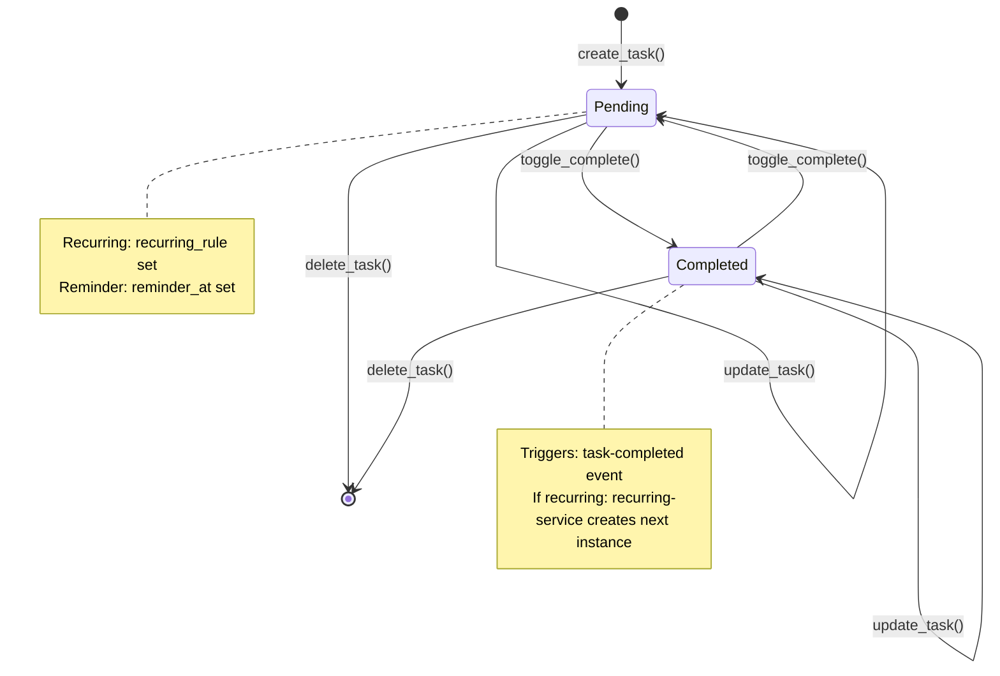

# Data Model: Microservices Event-Driven Architecture

**Feature**: 013-microservices-dapr
**Date**: 2026-02-04
**Phase**: Phase 1 - Design & Contracts

## Overview

This document describes the data model for the event-driven microservices architecture, including existing entities, new entities for microservices patterns, and event schemas for pub/sub communication.

---

## Existing Models (Unchanged)

### Task

**Table**: `tasks`
**Purpose**: Core todo item entity

| Field | Type | Constraints | Description |
|-------|------|-------------|-------------|
| `id` | UUID | PRIMARY KEY | Unique identifier |
| `title` | VARCHAR(255) | NOT NULL | Task title |
| `description` | TEXT | nullable | Detailed description |
| `priority` | VARCHAR | NOT NULL | `low`, `medium`, `high` |
| `category` | VARCHAR | NOT NULL | `work`, `personal`, `home`, `other` |
| `status` | VARCHAR | NOT NULL, default `pending` | `pending`, `completed` |
| `completed` | BOOLEAN | default `false` | Completion flag |
| `due_date` | TIMESTAMP | nullable | Due date/time |
| `created_at` | TIMESTAMP | NOT NULL | Creation timestamp |
| `updated_at` | TIMESTAMP | NOT NULL | Last update timestamp |
| `user_id` | VARCHAR | NOT NULL | Owner identifier |
| `recurring_rule` | VARCHAR | nullable | `daily`, `weekly`, `monthly`, `yearly` |
| `recurring_end_date` | TIMESTAMP | nullable | Recurring stop date |
| `parent_task_id` | UUID | nullable, FK→tasks.id | Parent recurring task |
| `reminder_at` | TIMESTAMP | nullable | Reminder time |
| `reminder_sent` | BOOLEAN | default `false` | Reminder delivered flag |
| `tags` | TEXT[] | nullable | PostgreSQL array of tags |

**Indexes**:
- `idx_tasks_user_id` on `user_id`
- `idx_tasks_status` on `status`
- `idx_tasks_due_date` on `due_date`
- `idx_tasks_reminder_at` on `reminder_at`

### Notification

**Table**: `notifications`
**Purpose**: User notifications for reminders and updates

| Field | Type | Constraints | Description |
|-------|------|-------------|-------------|
| `id` | UUID | PRIMARY KEY | Unique identifier |
| `user_id` | VARCHAR | NOT NULL | Recipient identifier |
| `message` | TEXT | NOT NULL | Notification content |
| `task_id` | UUID | nullable, FK→tasks.id | Related task |
| `type` | VARCHAR | NOT NULL | `reminder`, `update`, `system` |
| `read` | BOOLEAN | default `false` | Read status |
| `created_at` | TIMESTAMP | NOT NULL | Creation timestamp |

**Indexes**:
- `idx_notifications_user_id` on `user_id`
- `idx_notifications_read` on `read`
- `idx_notifications_created_at` on `created_at`

### AuditLog

**Table**: `audit_logs`
**Purpose**: Complete history of all state changes

| Field | Type | Constraints | Description |
|-------|------|-------------|-------------|
| `id` | UUID | PRIMARY KEY | Unique identifier |
| `event_type` | VARCHAR | NOT NULL | `created`, `updated`, `deleted`, `completed` |
| `entity_type` | VARCHAR | NOT NULL | `task`, `notification`, `user` |
| `entity_id` | UUID | NOT NULL | Affected entity |
| `user_id` | VARCHAR | NOT NULL | Actor identifier |
| `data` | JSONB | nullable | Event payload (old/new values, changes) |
| `created_at` | TIMESTAMP | NOT NULL | Event timestamp |

**Indexes**:
- `idx_audit_logs_user_id` on `user_id`
- `idx_audit_logs_entity` on `entity_type`, `entity_id`
- `idx_audit_logs_created_at` on `created_at`

---

## Idempotency via Dapr State Store

**⚠️ IMPORTANT**: Do NOT create a `processed_events` SQL table. Idempotency uses Dapr's generic `state` table.

### State Table (for Dapr State Store)

**Table**: `state` (required by Dapr)
**Purpose**: Generic key-value storage for Dapr State Store, used for idempotency tracking

| Field | Type | Constraints | Description |
|-------|------|-------------|-------------|
| `key` | TEXT | PRIMARY KEY | State key (e.g., `processed-{event_id}-{service_name}`) |
| `value` | JSONB | - | State value (e.g., `{"processed_at": "..."}`) |
| `isbinary` | BOOLEAN | default FALSE | Binary flag |
| `insertdate` | TIMESTAMP | default NOW() | Creation timestamp |
| `updatedate` | TIMESTAMP | default NOW() | Update timestamp |

**Migration SQL** (`migrations/003_dapr_state.sql`):
```sql
CREATE TABLE IF NOT EXISTS state (
    key TEXT PRIMARY KEY,
    value JSONB,
    isbinary BOOLEAN DEFAULT FALSE,
    insertdate TIMESTAMP DEFAULT NOW(),
    updatedate TIMESTAMP DEFAULT NOW()
);
```

**Key Format for Idempotency**: `processed-{event_id}-{service_name}`

**Example**: `processed-550e8400-e29b-41d4-a716-446655440000-audit-service`

---

## Event Schemas

### Event Envelope (Base Schema)

All events follow the standard envelope format per **Constitution IV.B**:

```typescript
interface EventEnvelope {
  event_id: string;        // UUID v4
  timestamp: string;        // ISO 8601 UTC
  event_type: string;       // Format: domain.entity.action
  user_id: string;          // For partitioning
  correlation_id: string;   // For tracing (defaults to event_id)
  data: unknown;            // Event-specific payload
}
```

### TaskCreatedEvent

**Topic**: `task-created`
**Publisher**: backend-api
**Subscribers**: audit-service, websocket-service

```typescript
interface TaskCreatedData {
  task_id: string;
  title: string;
  description?: string;
  priority: 'low' | 'medium' | 'high';
  category: 'work' | 'personal' | 'home' | 'other';
  status: 'pending';
  due_date?: string;        // ISO 8601
  recurring_rule?: string;  // 'daily' | 'weekly' | 'monthly' | 'yearly'
  reminder_at?: string;     // ISO 8601
  tags?: string[];          // Array of tag strings
}

interface TaskCreatedEvent extends EventEnvelope {
  event_type: 'task-created';
  data: TaskCreatedData;
}
```

**Example**:
```json
{
  "event_id": "550e8400-e29b-41d4-a716-446655440000",
  "timestamp": "2026-02-04T10:30:00Z",
  "event_type": "task-created",
  "user_id": "user-123",
  "correlation_id": "550e8400-e29b-41d4-a716-446655440000",
  "data": {
    "task_id": "550e8400-e29b-41d4-a716-446655440001",
    "title": "Complete project documentation",
    "priority": "high",
    "category": "work",
    "status": "pending",
    "due_date": "2026-02-10T17:00:00Z",
    "recurring_rule": "weekly"
  }
}
```

### TaskUpdatedEvent

**Topic**: `task-updated`
**Publisher**: backend-api
**Subscribers**: audit-service, websocket-service

```typescript
interface TaskUpdatedData {
  task_id: string;
  title?: string;
  changes: Record<string, {old: unknown, new: unknown}>;
}

interface TaskUpdatedEvent extends EventEnvelope {
  event_type: 'task-updated';
  data: TaskUpdatedData;
}
```

### TaskCompletedEvent

**Topic**: `task-completed`
**Publisher**: backend-api
**Subscribers**: audit-service, recurring-service, websocket-service

```typescript
interface TaskCompletedData {
  task_id: string;
  title: string;
  recurring_rule?: string;  // Present if task was recurring
  completed: true;
  next_instance_id?: string;  // Set by recurring-service if applicable
}

interface TaskCompletedEvent extends EventEnvelope {
  event_type: 'task-completed';
  data: TaskCompletedData;
}
```

### TaskDeletedEvent

**Topic**: `task-deleted`
**Publisher**: backend-api
**Subscribers**: audit-service, websocket-service

```typescript
interface TaskDeletedData {
  task_id: string;
  title?: string;  // May include title for audit
}

interface TaskDeletedEvent extends EventEnvelope {
  event_type: 'task-deleted';
  data: TaskDeletedData;
}
```

### ReminderDueEvent

**Topic**: `reminder-due`
**Publisher**: notification-service (after processing reminder check)
**Subscribers**: websocket-service

```typescript
interface ReminderDueData {
  task_id: string;
  user_id: string;
  title: string;
  due_date?: string;
  notification_id: string;
}

interface ReminderDueEvent extends EventEnvelope {
  event_type: 'reminder-due';
  data: ReminderDueData;
}
```

### TaskUpdatesEvent (Aggregated)

**Topic**: `task-updates`
**Publisher**: websocket-service (aggregates all task events)
**Subscribers**: websocket-service (for broadcasting)

**Note**: This is a fan-out topic for WebSocket broadcasting. The websocket-service subscribes to all task events and republishes to this topic for efficient broadcasting to all connected clients.

---

## State Machine: Task Lifecycle



---

## Data Flow Diagrams

### Task Creation Flow

```
User → Frontend → Next.js API Route → Dapr → backend-api
                                                      ↓
                                                 Save to DB
                                                      ↓
                                            Publish task-created
                                                      ↓
                            ┌─────────────────────────┴─────────────────────────┐
                            ↓                       ↓                           ↓
                      audit-service          websocket-service              (future)
                            ↓                       ↓
                      Log to DB              Broadcast to clients
```

### Recurring Task Completion Flow

```
User → Frontend → API → Dapr → backend-api
                                    ↓
                               Complete task
                                    ↓
                         Publish task-completed
                                    ↓
                            ┌────────┼────────┐
                            ↓        ↓        ↓
                      audit-service recurring-service websocket-service
                            ↓        ↓        ↓
                          Log     Create next  Broadcast
                                  instance
```

### Reminder Processing Flow

```
Dapr Cron Binding (@every 1m)
                ↓
      notification-service
                ↓
         Query due reminders
                ↓
      Create notifications
                ↓
    Publish reminder-due
                ↓
        websocket-service
                ↓
    Broadcast to clients
```

---

## Entity Relationship Diagram

```
┌─────────────┐         ┌──────────────┐         ┌─────────────┐
│    User     │         │     Task     │         │ Notification│
│─────────────│         │──────────────│         │─────────────│
│ id (PK)     │    ┌────│ id (PK)      │    ┌────│ id (PK)     │
│ email       │    │    │ user_id (FK) │───┘    │ user_id (FK)│
│ name        │    │    │ title        │         │ task_id (FK)│
│ ...         │    │    │ status       │         │ type        │
└─────────────┘    │    │ parent_id    │         │ read        │
                   │    │ reminder_at  │         └─────────────┘
                   │    └──────────────┘
                   │
                   │    ┌──────────────┐
                   └────│  AuditLog    │
                        │──────────────│
                        │ id (PK)      │
                        │ entity_id    │
                        │ user_id (FK) │
                        │ data (JSONB) │
                        └──────────────┘

┌──────────────┐
│  Dapr State  │
│──────────────│
│ key (PK)     │
│ value (JSONB)│
└──────────────┘
```

---

## Data Validation Rules

### Task Validation

| Field | Validation Rule |
|-------|----------------|
| `title` | Required, max 255 chars |
| `priority` | Must be one of: `low`, `medium`, `high` |
| `category` | Must be one of: `work`, `personal`, `home`, `other` |
| `status` | Must be one of: `pending`, `completed` |
| `recurring_rule` | If set, must be one of: `daily`, `weekly`, `monthly`, `yearly` |
| `reminder_at` | Must be in the future (optional) |
| `due_date` | Must be in the future (optional) |
| `tags` | Max 10 tags, each max 50 chars |

### Event Validation

| Field | Validation Rule |
|-------|----------------|
| `event_id` | Required, valid UUID v4 |
| `timestamp` | Required, ISO 8601 format |
| `user_id` | Required, non-empty string |
| `event_type` | Required, matches topic name |
| `data.task_id` | Required for task events, valid UUID |

---

## Database Migration Strategy

### Migration Order

1. **003_dapr_state.sql** - Create Dapr State Store table for idempotency
2. **Future**: Add indexes for event querying if needed
3. **Future**: Partition audit_logs by date if retention policy needed

### Rollback Strategy

```sql
-- Rollback for 003_dapr_state.sql
DROP TABLE IF EXISTS state;
```

---

## References

- [Constitution III.B: Data Consistency & Schema](../../.specify/memory/constitution.md)
- [SQLModel Documentation](https://sqlmodel.tiangolo.com/)
- [PostgreSQL Array Types](https://www.postgresql.org/docs/current/arrays.html)
- [PostgreSQL JSONB](https://www.postgresql.org/docs/current/datatype-json.html)
